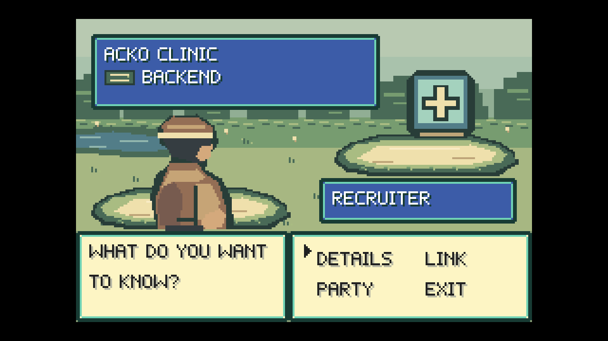

# P10 post-review release blocker remediation

Status: PASS for the local production build. Ready for review and redeployment. P11 has not started; this run does not deploy to the public site.

The accepted content result is unchanged: 12 projects, 18 audience/project trees, 394 supplied questions, 387 verbatim answers, and seven repository-backed Pokefolio status updates.

## Root causes and fixes

### Real battle entry

The first failure was the bridge acknowledgement deadline expiring during cold artwork loading. There was no missing scene registration or broken asset URL in the reproduction.

The actual path was:

1. The root-route WorldSim encounter reaches audience selection.
2. VS and the battle wipe complete; `GameOrchestrator` sets `battleVisible`.
3. React's `BattleOrchestrator` attaches `BattleView`, which sends `loadBattleScene` through GameBridge.
4. WorldScene finds the registered `PokefolioBattle`, subscribes to `battle-created`, and launches it.
5. BattleScene's preload fetches the manifest, then five images: two sequential network stages.
6. With 850 ms latency on each artwork request, all assets return HTTP 200, but total loading takes approximately 1.73 seconds.
7. The unchanged 1,500 ms command watchdog rejects first. React records `Battle artwork unavailable`; `viewReady` stays false, so initial sprite updates are never sent.
8. The scene later creates and emits readiness, but GameBridge has already settled the command as rejected. Late readiness cannot repair that entry.

Fix: the shared `preloadBattleAssets` loader loads the existing five scene textures during game initialization, before `worldReady`/PRESS START. BattleScene reuses the texture cache; the standalone arena uses the same loader. The battle-entry acknowledgement now waits for scene creation, without network work inside its watchdog. The bridge timeout remains 1,500 ms. Asset failures still report the specific failing asset and prevent false initialization readiness.

Evidence: `battle-entry-before.json` and `blockers-before.log` capture the cold-load failure; `battle-entry-trace.json` shows all scene assets loaded before overworld readiness, followed by actual encounter, VS, battle readiness, and exact return.

### First interaction behind the challenger

WorldSim already turns the challenger toward the player before returning `interactionRequested`. The runtime handler previously handled only repeat encounters, so it never ran the first-encounter evaluator after that turn.

Fix: first challenger interaction calls the existing `tryFirstEncounter`. That evaluator reads the authoritative WorldSim snapshot, including the new facing, rather than the bridge's previously published snapshot. Its existing range, collision, other-NPC blocker, movement, flow, and first-encounter guards remain authoritative. Repeat encounters retain their existing direct-interaction path with automatic LOS disabled. No duplicate encounter predicate or behind-NPC exception was added.

`encounter-regression-before.log` proves that restoring the old handler makes the new immediate-entry regression fail; the fixed handler passes.

## Files changed for remediation

| File | Change |
|---|---|
| `src/game/battleAssets.ts` | Shared manifest/texture preload and readiness check; cached assets reused. |
| `src/game/WorldScene.ts` | Preload battle art during initialization; route battle asset failures correctly and gate world readiness. |
| `src/game/BattleScene.ts` | Consume the shared loader and texture list. |
| `src/runtime/Orchestrator.ts` | Reevaluate the existing first-encounter condition after challenger interaction. |
| `tests/runtime/encounter-entry.spec.ts` | Five runtime integration regressions through WorldSim, WorldSession, GameBridge and GameOrchestrator. |
| `tests/e2e/release-entry.spec.ts` | Two real-time production root-route regressions, three audience battle entries, exact returns, cold-network coverage, and actual game screenshots. |
| `tests/helpers/axe.ts` | Replace preexisting explicit-any wrapper with a typed callable/run adapter so the required lint check passes. |
| `tests/ui/content-labels.spec.tsx` | Remove the preexisting explicit-any violation annotation. |
| `artifacts/phase-10/` | This updated report, logs, trace, screenshots and capture metadata. |

Existing P10 content edits were preserved. No map, collision, LOS algorithm, camera, battle reducer, Party membership, art, palette, font, window geometry, scaling, or physical-pixel renderer was changed for remediation. No dependency was added for these fixes. Earlier-phase evidence regenerated by the legacy tests was restored while preserving already-existing changed evidence.

## Regression coverage

| Requirement | Coverage | Result |
|---|---|---|
| Overworld → first LOS → audience → VS → actual scene → initial project | Unmocked-clock Chromium at `/`; cold artwork latency of 850 ms per request | PASS |
| Behind interaction → newly turned facing → immediate first encounter | Real keyboard browser path at tile 19,7 and runtime integration | PASS |
| Turned challenger beyond three tiles → no encounter | Runtime integration with an out-of-range/stale interaction event | PASS |
| Turned challenger with solid LOS blocker → no encounter | Runtime integration with isolated test-only map copy | PASS |
| Normal first LOS still triggers automatically | Runtime integration and real root-route browser path | PASS |
| Subsequent encounters require direct interaction; LOS stays disabled | Runtime integration and actual Engineer → return → direct repeat → Visitor battle | PASS |
| Exact tile/facing restored after battle | Actual root-route Recruiter, Engineer and Visitor battles | PASS |

Distance/solid safety cases use runtime integration fixtures because normal WorldSim A interaction only targets an adjacent NPC; it cannot physically interact through an intervening wall or across four tiles. Those tests deliver an interaction event after changing authoritative facing and verify that the same production evaluator rejects invalid geometry. The production map is untouched.

## Checks

| Check | Result | Evidence |
|---|---|---|
| Full Vitest suite | 195 tests across 35 files PASS | `unit-remediation.log` |
| New real-time production browser regressions | 2 PASS; all three audiences and repeat entry | `browser-remediation.log` |
| Complete existing browser suite | 42 PASS, including P6 golden path, P7 keyboard/touch, P8 no-JS routes/PDF, P9 world/camera/doors, and rendering matrix | `e2e-regression.log` |
| Typecheck | PASS | `typecheck-remediation.log` |
| Lint | PASS, zero errors; three existing unused-import warnings | `lint-remediation.log` |
| Dependency boundaries | PASS: 139 modules, 479 dependencies | `boundaries-remediation.log` |
| World validation | PASS: frozen 36×22 world, three interiors, two ordinary NPCs, one challenger | `world-remediation.log` |
| Strict content/source validation | PASS: 18 trees; 394 supplied questions; 387 verbatim answers | `build-remediation.log` |
| Production build | PASS; 12 statically generated project detail routes | `build-remediation.log` |
| Pixel inspection of four new captures | Zero mismatched 4× native pixel blocks | `remediation-captures.json` |

Lint warnings remain in the existing resume page, skills page, and content-completion core test. Vitest logs jsdom's unsupported canvas color-contrast probe; browser accessibility/rendering checks pass with a real canvas. No tests were skipped.

## Actual game evidence and visual observations

Every capture is from `/`, using the real game renderer and real Clock. No screenshot below comes from `/dev/battle`.

| Filename | State | CSS viewport | DPR | Integer scale |
|---|---|---|---|---|
| `actual-battle-entry.png` | Recruiter / Acko Clinic, ready command grid after initial send-out/reaction | 1280×720 | 1 | 4× |
| `actual-battle-engineer.png` | Engineer / Acko Clinic, entered after interaction from behind | 1280×720 | 1 | 4× |
| `actual-battle-visitor-repeat.png` | Visitor / Pokefolio, subsequent direct encounter and battle | 1280×720 | 1 | 4× |
| `behind-immediate-encounter.png` | Challenger facing the player immediately after A from behind | 1280×720 | 1 | 4× |

The rendered battle screenshots were visually inspected: original battle background and platforms are present, visitor and active-project art are visible, canonical project/audience plates and command grid render correctly, and the error overlay is absent. The behind-interaction capture shows adjacent sprites facing each other. Every frame retains a 240×160 native composition, a 960×640 rendered game area, black letterbox, and crisp 4× pixel blocks.

P10 blocker remediation is ready for human review/redeployment. P11 visual/audio work remains untouched.
